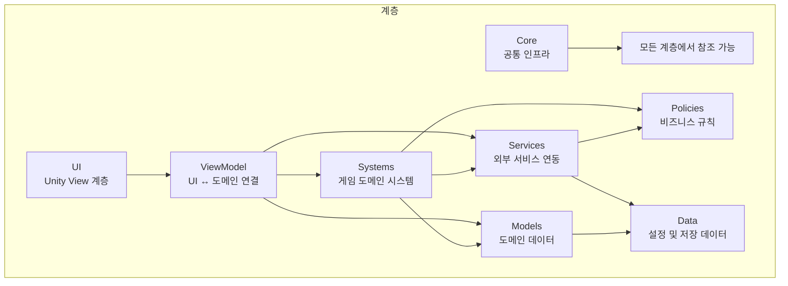
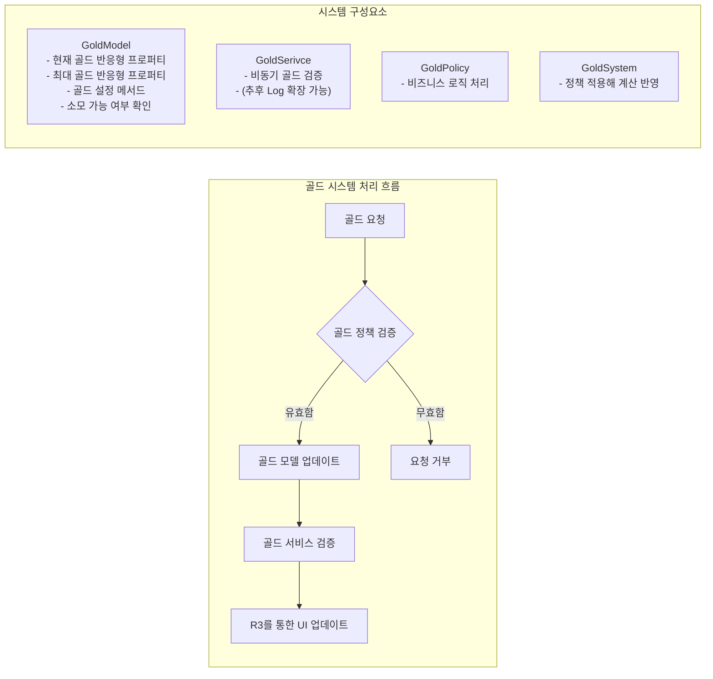
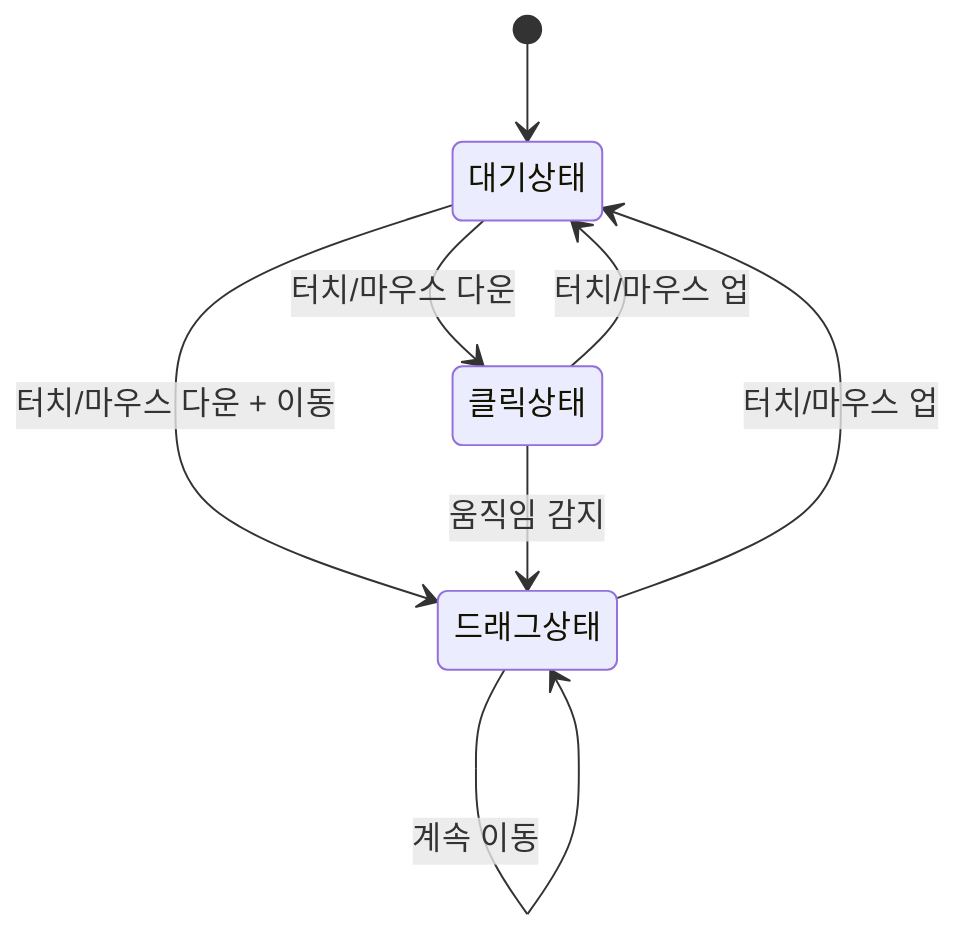
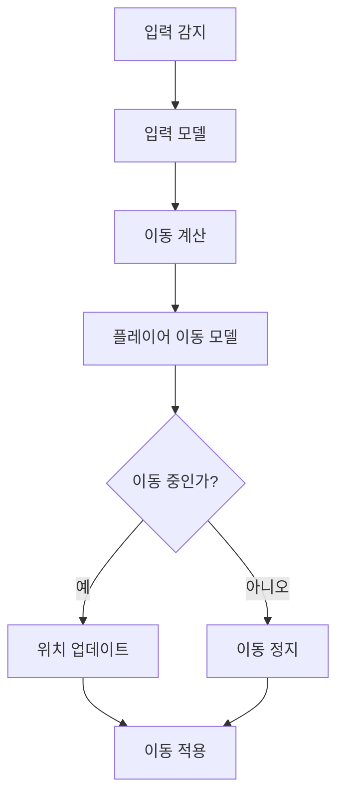
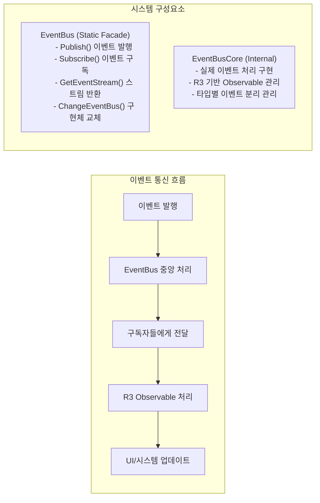
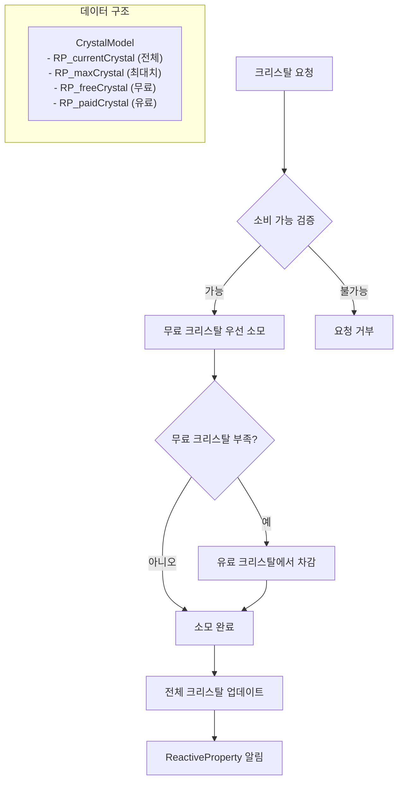
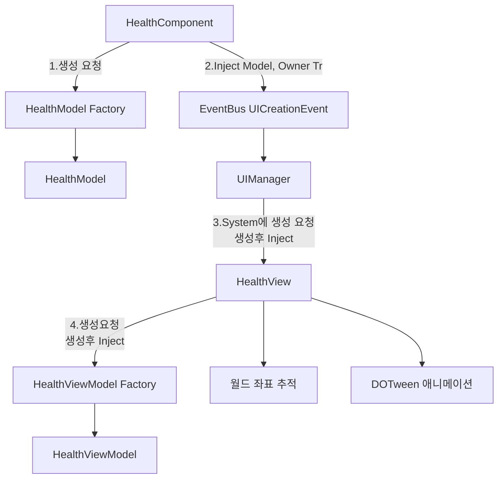
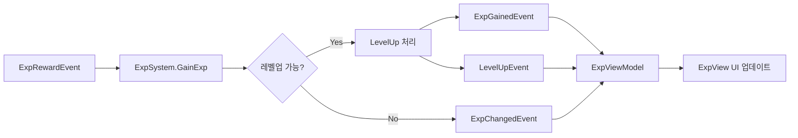
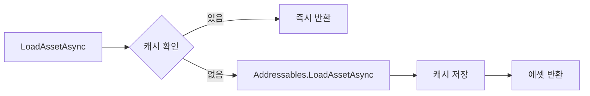

# 개발일지
## 목차
- [2025-07-26 - 프로젝트 계층 구조 설계](#1) 
- [2025-07-28 - Gold, Input, Move, UI Manager, DI 구현](#2)
- [2025-07-29 - Event Bus, Crystal, Time Manager, GameDebug 구현](#3)
- [2025-07-30 - Camera 구현](#4)
- [2025-08-02 - ~Health UI 시스템~ -> 중앙화, UISystem 수정](#5)
- [2025-08-03 - Firebase 통신, 크리스탈, 경험치 시스템 구현](#6)
- [2025-08-04 - Health 관련 로직 중앙화 변경](#7)
- [2025-08-08 - AddressableService, 전투 시스템, 게임 초기화, 데이터 관리, 에디터 도구 구현](#8)
---
<a id="1"></a>
## 📅 2025-07-26 
### 🎯 프로젝트 계층 구조 설계
#### 계층 구조
```
Root
 ┣ Core                // 이벤트, 상태머신, DI, 유틸
 ┣ Systems             // 게임 도메인 시스템(전투, 퀘스트, 인벤토리 등)
 ┃ ┣ ...
 ┣ Policies            // 정책 도메인
 ┣ Models              // 도메인 데이터 모델
 ┣ Services            // 네트워크, 저장, SDK 연동
 ┣ UI                  // Unity View 계층
 ┣ ViewModels          // UI <-> 도메인 상태 연결
 ┗ Data                // ScriptableObject, Config, DB 모델
```


---
<a id="2"></a>
## 📅 2025-07-28
### 🎯 Gold, Input, Move, UI Manager, DI 구현

#### 1. Gold 시스템 구현
- **`Gold Model`**: 반응형 골드 시스템 구현 완료
- **`Gold Service`**: 비동기 골드 검증 로직 구현
- **`Gold Policy`**: 골드 관련 비즈니스 로직 처리

#### 2. Input 시스템 구현
- **`Input Model`**: 터치/마우스 입력 처리 시스템 구현
- **`Input Policy`**: 입력 유효성 검증 로직 구현
- **드래그 및 클릭 감지**: 실시간 입력 상태 추적

#### 3. Move 시스템 구현
- **`Player Move Model`**: 플레이어 이동 데이터 관리
- **방향성 이동**: Vector2 기반 이동 시스템 구현

#### 4. UI Manager 시스템 구현
- **`UI Manager`**: UI 통합 관리 (실 UI 생성부)
- **`UI System`**: Canvas 계층 관리 및 UI 생명주기 처리
- **`UI Service`**: Addressable 기반 비동기 UI 로딩
- **`UI Model`**: 반응형 UI 상태 관리
- **`UI ViewModel`**: MVVM 패턴 적용한 UI 로직 분리
  
#### 5. DI(Dependency Injection) 시스템
- **Zenject 기반 DI**: 모듈별 의존성 주입 구현
- **계층별 바인딩**: Core, Model, Service, Policy 계층 분리

---

### Gold 시스템 상세



**주요 기능:**
- 최대, 최소 골드량 제한 
- 골드 소모 가능 여부 검증
- 골드 검증 로직
---

### Input 시스템 상세



**주요 기능:**
- 터치/마우스 입력 통합 처리
- 실시간 드래그 방향/거리 계산
- UI 클릭 무시 정책
- 입력 유효성 검증
---

### Move 시스템 상세



**주요 기능:**
- Vector2 기반 이동 방향 관리
- 이동 속도 제어
- 이동 상태 추적

---
### UI Manager 시스템 상세
**주요 구성 요소:**

#### 1. UI_Manager (싱글톤)
- 전역 UI 접근점
- `ViewModel`을 통한 UI 요청 위임
- `EventBus`를 통한 UI 생성 


#### 2. UIViewModel (MVVM 패턴)
- View와 Model 사이의 중간 계층
- UI 비즈니스 로직 분리
- `UISystem`으로 실제 작업 위임


#### 3. UISystem (핵심 로직)
- Canvas 계층 자동 생성 및 관리
- Screen/Popup 분리 관리
- UI 정렬 순서 및 이벤트 처리


#### 4. UIService (리소스 관리)
- Addressable 기반 비동기 로딩
- UI 인스턴스 생성/해제
- 메모리 관리 및 핸들 추적

---

### DI 바인딩 시스템

#### Scene 별 바인딩
```c#
// SystemsInstaller.cs
public override void InstallBindings() {
     switch (_sceneName) {
         case SceneName.MainLobby:
         BindMainLobbySystem();
         break;
         case SceneName.Play:
         BindInputStrategies();
         BindGameplaySystems();
         break;
     }
 }
```

**바인딩 전략:**
- **계층별 바인딩**: 계층별로 각자 바인딩
- **Scene별 조건부 바인딩**: `SceneName(enum)`에 따른 선택적 바인딩

---

### 📋 다음 개발 예정 사항
- PlayerMover 구현
- Crystal 구현
---
<a id="3"></a>
# 📅 2025-07-29
## 🎯 Event Bus, Crystal, Time Manager, GameDebug 구현

#### 1. Event Bus 구현
- **`Event Bus`**: 이벤트 기반 느슨한 결합 시스템 구현
- **시스템 간 통신**: 직접 참조 없이 이벤트로 모듈 간 통신
- **R3 기반 반응형**: Observable 패턴으로 비동기 이벤트 처리
- **Static**: 전역 접근 편의성 제공

#### 2. Crystal 구현
- **`Crystal Model`**: 무료/유료 크리스탈 분리 관리 시스템
- **ReactiveProperty 적용**: 실시간 상태 변화 추적
- **소비 우선순위**: 무료 -> 유료 순서로 스마트 소비
- **최대 보유량 제한**: 9,999,999 크리스탈 한도 관리

#### 3. Time Manager 구현
- **`GameTime`**: Static 접근 인터페이스로 전역 시간 관리
- **`TimeManager`**: 일시정지/재개 및 시간 배율 제어
- **EventBus 연동**: 상태 변화 시 자동 이벤트 발행
- **DeltaTime 제어**: 일시정지 상태 고려한 시간 계산

#### 4. GameDebug 로깅 구현
- **조건부 컴파일**: UNITY_EDITOR/DEVELOPMENT_BUILD 환경에서만 동작
---
### Event Bus 시스템 상세

**주요 기능:**
- 시스템 간 직접 참조 제거
- Observable 패턴을 통한 비동기 처리

---
### Crystal 경제 시스템 상세

**주요 기능:**
- 무료/유료 크리스탈 분리 관리
- 스마트 소비 로직 (무료 -> 유료)
- 최대 보유량 제한

---
### Time Manager 시스템 상세
**주요 구성 요소:**
#### 1. GameTime (Static)
- 전역 시간 관리 접근점
- DeltaTime 일시정지 상태 고려
- TimeScale, IsPaused 상태 제공

#### 2. TimeManager (Internal)
- ReactiveProperty로 상태 변화 감지
- EventBus 연동 자동 이벤트 발행

**주요 기능:**
- 게임 일시정지/재개 제어
- 상태 변화 시 자동 이벤트 알림

---
### GameDebug 로깅 시스템 상세

**주요 기능:**
- 조건부 컴파일을 통한 성능 최적화
- 개발 환경에서만 동작
---


### 📋 다음 개발 예정 사항
- GamePlay Logic 개발
---
<a id="4"></a>
# 📅 2025-07-30
## 🎯 Camera 시스템 구현

#### 1. Camera Config 구현
- **`SO_CameraConfig`**: 카메라 설정 데이터 관리
- **주요 특징**: Follow, Zoom, Shake 데이터 분리
- **설정 데이터**: 속도, 시간, 오프셋, 줌 범위, 셰이크 강도
- **ScriptableObject**: 인스펙터에서 실시간 조정 가능

#### 2. Camera Model 구현
- **`CameraModel`**: R3 ReactiveProperty로 카메라 상태 관리
- **주요 상태**: 타겟 위치, 줌, 추적 상태, 셰이크 상태
- **ReactiveProperty**: 상태 변화 자동 감지 -> UI 업데이트
- **ReadOnly**: 외부에서 읽기 전용 접근

#### 3. Camera Policy 구현
- **`CameraPolicy`**: 카메라 동작 규칙 정의
- **검증 로직**: Follow 가능성, Zoom 범위, Shake 허용 여부
- **Position Clamp**: 카메라 이동 범위 제한
- **확장성**: 추후 조건 추가 가능한 구조

#### 4. Camera Service 구현
- **`CameraService`**: DOTween 기반 카메라 제어
- **비동기 처리**: UniTask로 부드러운 애니메이션
- **기능**: Position/Zoom 즉시 설정, 애니메이션 이동, 셰이크
- **Tween 관리**: 중복 애니메이션 방지, 정리 기능

#### 5. Camera System 구현
- **`CameraSystem`**: 이벤트 기반 카메라 로직 통합
- **EventBus**: 카메라 이벤트 처리
- **Follow 로직**: Updater와 연동한 실시간 타겟 추적
- **상태 관리**: Model -> Service 단방향 흐름

---
### Camera 시스템 상세
**주요 기능:**
- 타겟 추적: 실시간 Follow 기능 (오프셋 적용)
- 부드러운 이동: DOTween 기반 애니메이션
- 줌 제어: Orthographic/Perspective 모두 지원
- 화면 흔들기: 강도/시간 조절 가능 셰이크

**주요 구성 요소:**
#### 1. SO_CameraConfig (Data)
- CameraFollowData: 추적 속도, 부드러움, 오프셋
- CameraZoomData: 최소/최대/기본 줌, 줌 속도
- CameraShakeData: 강도, 지속시간, 주파수, 커브

#### 2. CameraModel (Model)
- ReactiveProperty로 상태 관리
- 타겟 위치, 줌, 추적 대상, 셰이크 상태 등

#### 3. CameraService (Service)
- DOTween 기반 카메라 제어
- 즉시 설정 + 애니메이션 기능 분리

#### 4. CameraSystem (System)
- 이벤트 타입 처리
- Policy 기반 검증

---
<a id=5></a>
# 📅 2025-08-02
## 🎯 ~Health UI 시스템~ -> 중앙화로 변경, UISystem 수정

#### 1. Health UI 시스템 구현
- **`HealthModel`**: R3 ReactiveProperty 기반 체력 관리, Factory 패턴
- **`HealthViewModel`**: Model 데이터 UI 바인딩, 저체력 임계값 30% 처리  
- **`HealthView`**: 월드 좌표 추적 HUD, DOTween 애니메이션, IHealthInjecter 구현
- **`HealthComponent`**: EventBus UI 생성 요청, Model Factory 생성
- **`IHealthInjecter`**: Health UI-Model 연결 계약 인터페이스
- **기술 요소**: EventBus -> UIManager -> UIViewModel -> UISystem
- **제한사항**: 저체력 30%, 부활 최소 체력 1

#### 2. UISystem 수정
- **`UISystem`**: UI 계층별 Canvas 관리, HUD 다중 생성 지원
- **주요 특징**: HUD/Screen/Popup/Overlay 분리, EventBus 알림
- **기술 요소**: Canvas Sorting Order -> 자동 부모 설정
- **제한사항**: HUD 다중, 나머지 단일 생성

---
### Health UI 시스템 상세



**주요 기능:**
- 실시간 월드 좌표 추적 HUD UI
- 체력 변화 DOTween 애니메이션 (변화량에 따른 지속시간)
- 저체력/사망 상태별 색상 변경
- Context Menu 테스트 기능

**주요 구성 요소:**
#### 1. HealthModel (Game.Models)
- R3 ReactiveProperty로 체력 상태 관리
- TakeDamage, Heal, Revive 메서드 제공
- Factory 패턴으로 Zenject 생성

#### 2. IHealthInjecter (Game.Core)
- Health UI와 Model 연결 계약 인터페이스
- HealthComponent에서 EventBus를 통해 호출
- GameObject와 offset으로 UI 위치 설정

#### 3. HealthViewModel (Game.ViewModels)
- Model 데이터를 UI 바인딩용으로 변환
- 체력 텍스트, 비율, 저체력 상태 관리
- CompositeDisposable로 구독 관리

#### 4. HealthView (Game.UI)
- 월드 좌표 실시간 추적 HUD
- DOTween 체력바 애니메이션
- IHealthInjecter 구현으로 Model 주입

#### 5. HealthComponent (Game.Systems)
- EventBus로 UI 생성 요청
- HealthModel Factory로 모델 생성
- offset과 UI 사용 여부 설정

---
### 📋 다음 개발 예정 사항
- Firebase Crystal 연동
- Exp 시스템 구현
---
<a id=6></a>
# 📅 2025-08-03
## 🎯 Firebase 통신, 크리스탈, 경험치 시스템 구현

#### 1. Firebase 통신 시스템 구현
- **`FirebaseService`**: Firebase Database 연동 및 크리스탈 데이터 관리
- **주요 특징**: 게스트 계정 자동 생성, 실시간 토큰 검증
- **기술 요소**: UniTask 비동기 처리 -> JsonUtility 직렬화
- **제한사항**: 30초 연결 타임아웃, 음수 방지 로직

#### 2. 네트워크 서비스 인터페이스 구현  
- **`INetworkService`**: Firebase 서비스 추상화 인터페이스
- **특징**: IsReady 상태 관리, WaitUntilReadyAsync 대기 메서드
- **기술 요소**: 의존성 분리 -> 테스트 가능한 구조

#### 3. 크리스탈 서비스 구현
- **`CrystalService`**: 무료/유료 크리스탈 분리 관리  
- **주요 기능**: AddFreeCrystal, AddPaidCrystal, SpendCrystal, LogCrystal
- **기술 요소**: Firebase 연동 -> 로그 시스템 통합
- **제한사항**: 네트워크 연결 필수, 실패시 false 반환

#### 4. 경험치 시스템 구현
- **`ExpSystem`**: 경험치 획득, 레벨업, 최대레벨 처리
- **특징**: 연속 레벨업 지원, 초과 경험치 자동 계산
- **기술 요소**: EventBus 이벤트 -> 외부 시스템 연동
- **제한사항**: 최대 레벨 100, 설정 기반 경험치 공식

#### 5. 경험치 이벤트 시스템 구현
- **`ExpEvents`**: ExpGainedEvent, LevelUpEvent, MaxLevelReachedEvent 등
- **특징**: readonly struct 구조, 불변성 보장
- **기술 요소**: EventBus 패턴 -> 시스템간 느슨한 결합

---
### 경험치 시스템 상세


**주요 기능:**
- 외부 이벤트 기반 경험치 획득 (몬스터 처치, 퀘스트 완료 등)
- 연속 레벨업 지원으로 대량 경험치 처리 가능
- 초과 경험치 자동 이월 및 최대레벨 도달시 경험치 0 고정
- DOTween 기반 레벨업 애니메이션 (경험치바 채우기 → 초기화 → 새 레벨 표시)

**주요 구성 요소:**
#### 1. ExpModel (ReactiveProperty)
- 현재 경험치, 레벨, 최대 경험치, 최대 레벨 관리
#### 2. ExpSystem (비즈니스 로직)  
- 경험치 획득, 레벨업 계산, 이벤트 발행
#### 3. ExpViewModel (UI 바인딩)
- 레벨 텍스트 포맷팅, 진행률 계산
#### 4. ExpView (UI 표현)
- 경험치바 애니메이션, 레벨업 시퀀스
---
<a id=7> </a>
# 📅 2025-08-04
## 🎯 Health 관련 로직 중앙화 변경

#### 1. HealthSystem 통합 구현
- **`HealthSystem`**: 개별 ViewModel/Model을 하나의 중앙 시스템으로 통합
- **변경사항**: 분산된 개별 관리 -> 단일 HealthSystem + HealthModel 구조
- **기술 요소**: HealthSystem -> HealthModel -> CharacterEvents -> UI 동기화
- **관리방식**: Dictionary 기반 다중 캐릭터 통합 관리

#### 2. CharacterEvents 이벤트 드리븐 구현
- **`CharacterEvents`**: 이벤트로 완전한 디커플링
- **기술 요소**: 생명주기 -> 데미지/치료 -> 설정 변경 이벤트

#### 3. HealthViewModel 단순화 구현
- **`HealthViewModel`**: 개별 로직 제거, ReactiveProperty 중심 UI 바인딩
- **변경사항**: 복잡한 개별 관리 로직 -> HealthSystem 위임 + UI 전용
- **기술 요소**: HealthModel ReactiveProperty -> UI 데이터 변환

#### 4. HealthView UI 최적화 구현
- **`HealthView`**: DOTween 기반 부드러운 체력바 애니메이션
- **특징**: EventBus 구독으로 실시간 UI 업데이트
- **기술 요소**: WorldToScreen UI 추적 + 색상/애니메이션 시스템

---
### Health System 중앙화 구조 상세

**주요 기능:**
- **기존**: 캐릭터별 개별 ViewModel/Model 분산 관리
- **변경**: 하나의 HealthSystem + HealthModel로 통합 중앙화
- characterID 기반 Dictionary 통합 관리
- ReactiveProperty 기반 실시간 UI 동기화

**주요 구성 요소:**
#### 1. HealthSystem (System)
- 모든 체력 로직을 중앙 집중화
- HealthModel 통한 데이터 관리 위임
- CharacterEvents 발행으로 시스템 간 디커플링
- 검증/로깅 등 비즈니스 로직 처리 -> 추후 Policy로 분리 예정

#### 2. HealthModel (Model)
- Dictionary<int, ReactiveProperty<HealthData>> 기반 데이터 관리
- 개별 캐릭터별 ReactiveProperty 제공
- 데이터 변경 시 자동 알림 시스템

#### 3. CharacterEvents (Event)
- CharacterRegistered/Unregistered: 생명주기 관리
- DamageTaken/CharacterDeath: 데미지 처리
- Healed/Revived: 치료/부활 처리
- MaxHpChanged/HpSet: 직접 설정 변경

#### 4. HealthViewModel (ViewModel)
- HealthModel ReactiveProperty 구독
- UI 전용 데이터 변환 (텍스트 포맷, 비율)
- HealthSystem 메서드 위임 호출

#### 5. HealthView (View)
- DOTween 기반 부드러운 애니메이션
- WorldToScreen 좌표 변환으로 3D 오브젝트 추적
- 색상 변화/깜빡임 등 시각적 피드백

---
### 📋 다음 개발 예정 사항
- 전투 시스템 개발
- HealthSystem 검증/로깅 등 비즈니스 로직 처리 -> Policy로 변경
---
<a id=8></a>
# 📅 2025-08-08
## 🎯 AddressableService, 전투 시스템, 게임 초기화, 데이터 관리, 에디터 도구 구현

#### 1. AddressableService 구현
- **`AddressableService<TKey, TAsset>`**: 제네릭 기반 에셋 로드 서비스
- **캐싱**: Dictionary로 로드된 에셋 관리 -> 중복 로드 방지
- **비동기 로드**: UniTask 활용 -> 성능 최적화
- **메모리 관리**: AsyncOperationHandle 추적 -> 언로드 시 메모리 해제

#### 2. EquipService 구현
- **`EquipService`**: CSV 기반 주소 키 자동 등록
- **프리팹 로드**: 생성된 객체 DI 자동 주입
- **Firebase 연동**: 장비 데이터 저장/로드 -> 클라우드 동기화
- **장비 관리**: 무기/방어구/악세사리 별도 관리

#### 3. WeaponComponent 구현
- **`WeaponComponent`**: IWeapon 인터페이스 구현 -> 무기 시스템 통합
- **스킬 연동**: SkillDataService로 데이터 로드 -> 동적 스킬 적용
- **범위 공격**: Circle/Sector/Rectangle/Line 타입 지원
- **데미지 계산**: (무기공격력 + 스킬추가데미지) * 스킬배율

#### 4. AnimControllComponent 구현
- **`AnimControllComponent`**: Animator 이벤트 브리지
- **상태 관리**: Attack/Move/Debuff/Death 애니메이션 제어
- **속도 제어**: AttackSpeed/MoveSpeed 파라미터 -> 동적 속도 조절
- **이벤트 전달**: IAnimAttackReceiver 인터페이스 -> 공격 타이밍 동기화

#### 5. EquipSystem 구현
- **`EquipSystem`**: 장비 데이터 관리 시스템
- **초기화**: Firebase에서 장비 데이터 로드 -> EquipModel 동기화
- **무기 인스턴스**: InstanceWeapon() -> 장착된 무기 프리팹 생성
- **데이터 저장**: EquipModel -> EquipData 변환 -> Firebase 저장

#### 6. GameInitSystem 구현
- **`GameInitSystem`**: 게임 초기화 총괄 시스템
- **비동기 초기화**: UniTask로 순차적 초기화 -> 의존성 보장
- **시스템 초기화 순서**: NetworkService -> CrystalSystem -> EquipSystem

#### 7. CSVReader 유틸리티 구현
- **`CSVReader`**: CSV 파일 파싱 유틸리티
- **Dictionary 변환**: Key-Value 형태로 자동 파싱
- **다중 컬럼 지원**: List<Dictionary> 형태 -> 복잡한 데이터 처리
- **타입 자동 변환**: 제네릭으로 int/float/string 자동 파싱

#### 8. SkillDataEditor 에디터 도구 구현
- **`SkillDataEditor`**: 스킬 범위 시각화 에디터
- **실시간 프리뷰**: Inspector에서 스킬 범위 미리보기
- **4가지 범위 타입**: Circle/Sector/Rectangle/Line 시각화

---
### AddressableService 상세

**주요 기능:**
- 제네릭 타입으로 다양한 에셋 지원
- CSV 파일로 주소 키 일괄 등록
- 비동기 로드 및 자동 캐싱
- 메모리 안전한 언로드

**주요 구성 요소:**
#### 1. Dictionary 캐시 시스템 (메모리)
- _loadedAssets: 로드된 에셋 저장
- _handles: AsyncOperationHandle 추적
- _keyToAddressMap: 키-주소 매핑

#### 2. CSV 기반 자동 등록 (설정)
- EquipAddressKey.csv: 장비 주소 매핑
- SkillAddressKey.csv: 스킬 주소 매핑

---
### 📋 다음 개발 예정 사항
- MainLobbyScene 구성
- LoadingScene 구성
---
