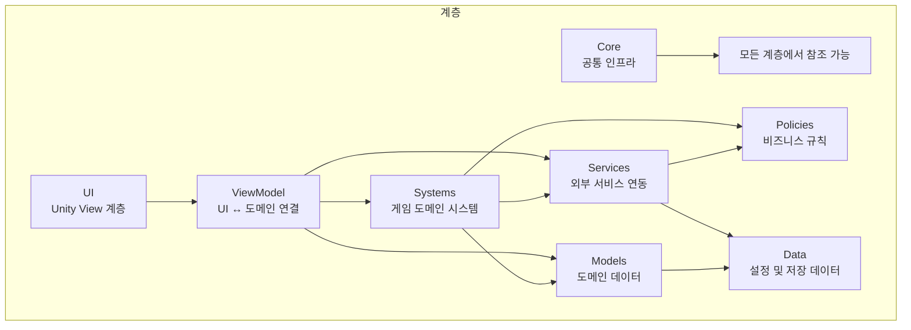
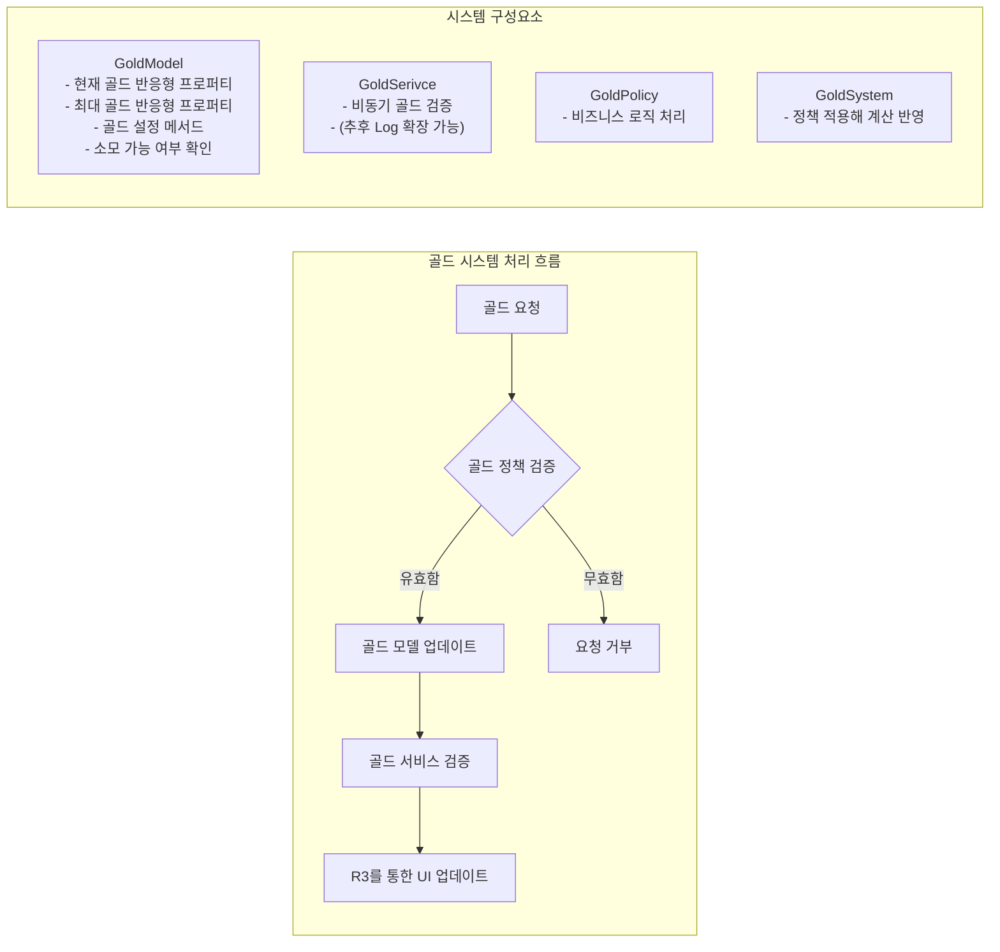
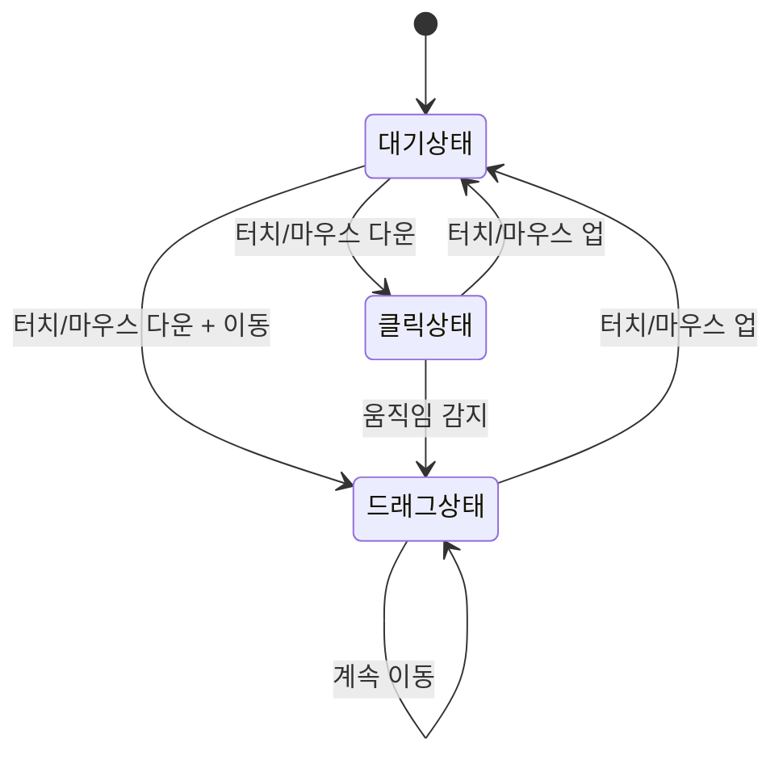
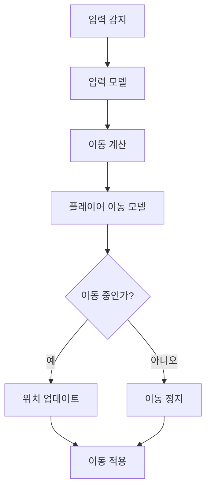

# 개발일지
## 목차
- [2025-07-26 - 프로젝트 계층 구조 설계](프로젝트-계층-구조-설계) 
- [2025-07-28 - Gold, Input, Move, UI Manager, DI 구현](gold-input-move)
---
## 📅 2025-07-26 
### 🎯 프로젝트 계층 구조 설계
#### 계층 구조
```
Root
 ┣ Core                // 이벤트, 상태머신, DI, 유틸
 ┣ Systems             // 게임 도메인 시스템(전투, 퀘스트, 인벤토리 등)
 ┃ ┣ ...
 ┣ Policies            // 정책 도메인
 ┣ Models              // 도메인 데이터 모델
 ┣ Services            // 네트워크, 저장, SDK 연동
 ┣ UI                  // Unity View 계층
 ┣ ViewModels          // UI <-> 도메인 상태 연결
 ┗ Data                // ScriptableObject, Config, DB 모델
```


---
## 📅 2025-07-28
### 🎯 Gold, Input, Move, UI Manager, DI 구현

#### 1. Gold 시스템 구현
- **`Gold Model`**: 반응형 골드 시스템 구현 완료
- **`Gold Service`**: 비동기 골드 검증 로직 구현
- **`Gold Policy`**: 골드 관련 비즈니스 로직 처리

#### 2. Input 시스템 구현
- **`Input Model`**: 터치/마우스 입력 처리 시스템 구현
- **`Input Policy`**: 입력 유효성 검증 로직 구현
- **드래그 및 클릭 감지**: 실시간 입력 상태 추적

#### 3. Move 시스템 구현
- **`Player Move Model`**: 플레이어 이동 데이터 관리
- **방향성 이동**: Vector2 기반 이동 시스템 구현

#### 4. UI Manager 시스템 구현
- **`UI Manager`**: UI 통합 관리 (실 UI 생성부)
- **`UI System`**: Canvas 계층 관리 및 UI 생명주기 처리
- **`UI Service`**: Addressable 기반 비동기 UI 로딩
- **`UI Model`**: 반응형 UI 상태 관리
- **`UI ViewModel`**: MVVM 패턴 적용한 UI 로직 분리
  
#### 5. DI(Dependency Injection) 시스템
- **Zenject 기반 DI**: 모듈별 의존성 주입 구현
- **계층별 바인딩**: Core, Model, Service, Policy 계층 분리

---

### Gold 시스템 상세



**주요 기능:**
- 최대, 최소 골드량 제한 
- 골드 소모 가능 여부 검증
- 골드 검증 로직
---

### Input 시스템 상세



**주요 기능:**
- 터치/마우스 입력 통합 처리
- 실시간 드래그 방향/거리 계산
- UI 클릭 무시 정책
- 입력 유효성 검증
---

### Move 시스템 상세



**주요 기능:**
- Vector2 기반 이동 방향 관리
- 이동 속도 제어
- 이동 상태 추적

---
### UI Manager 시스템 상세
**주요 구성 요소:**

#### 1. UI_Manager (싱글톤)
- 전역 UI 접근점
- `ViewModel`을 통한 UI 요청 위임
- `EventBus`를 통한 UI 생성 


#### 2. UIViewModel (MVVM 패턴)
- View와 Model 사이의 중간 계층
- UI 비즈니스 로직 분리
- `UISystem`으로 실제 작업 위임


#### 3. UISystem (핵심 로직)
- Canvas 계층 자동 생성 및 관리
- Screen/Popup 분리 관리
- UI 정렬 순서 및 이벤트 처리


#### 4. UIService (리소스 관리)
- Addressable 기반 비동기 로딩
- UI 인스턴스 생성/해제
- 메모리 관리 및 핸들 추적

---

### DI 바인딩 시스템

#### Scene 별 바인딩
```c#
// SystemsInstaller.cs
public override void InstallBindings() {
     switch (_sceneName) {
         case SceneName.MainLobby:
         BindMainLobbySystem();
         break;
         case SceneName.Play:
         BindInputStrategies();
         BindGameplaySystems();
         break;
     }
 }
```

**바인딩 전략:**
- **계층별 바인딩**: 계층별로 각자 바인딩
- **Scene별 조건부 바인딩**: `SceneName(enum)`에 따른 선택적 바인딩

---

### 📋 다음 개발 예정 사항
- PlayerMover 구현
- Crystal 구현
---

