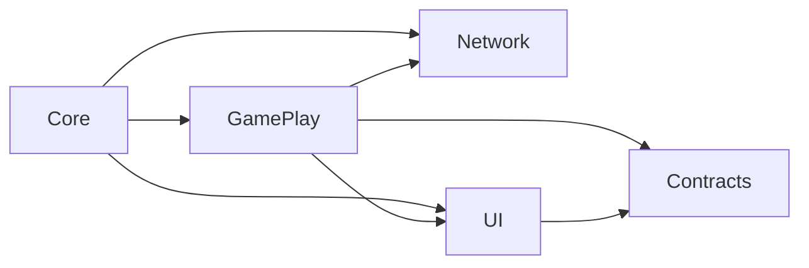
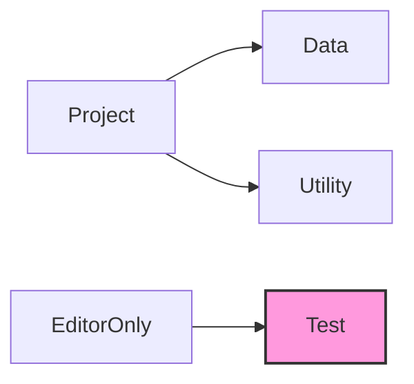

# 개발일지

---
### 7.26
## 프로젝트 네임스페이스 설계

#### 1. Core
역할: 게임의 전체 적으로 필요한 초기화 관리. 
주요 내용: 게임 초기화 관리 

#### 2. Data
역할: 게임 설정, 초기값, 영구 데이터 정의 및 관리. 
주요 내용: `ScriptableObject` 정의 (스탯, 정보 등), 설정 값, 데이터 테이블 구조, 데이터 저장/로드 인터페이스/기본 핸들러.

#### 3. GamePlay
역할: 실제 인게임 플레이 로직의 대부분. 핵심 게임 메커니즘 구현.  
주요 내용: 타워/적 로직 및 AI, 전투 시스템, 맵 시스템, 플레이어 상태(인게임), 로그라이크 요소, 아이템/스킬 로직. 게임 상태 관리, 씬 로딩, 핵심 게임 루프 관리, 인풋 관리.

#### 4. Network
역할: 네트워크 관련 기능.  
주요 내용: Firebase 연동.

#### 5. UI
역할: 사용자 인터페이스 요소 표시, 상호작용, 로직.  
주요 내용: 화면(View/Screen) 관리, (Button, Popup) 등 제어, UI 애니메이션/효과, UI 이벤트/데이터 바인딩.

#### 6. Utility
역할: 범용 헬퍼 함수, 확장 메소드, 유틸리티 클래스. 
주요 내용: 유틸리티

#### 7. Contracts
역할: `UI`와 `GamePlay`를 이어주는 `Contracts.Interface`. 
주요내용: 주로 구현되는 내용은 `Ineterface.Service`로직으로 `GamePlay`에서 구현된 `Service`내용을 `UI`의 `ViewModel`에서 참조 할수 있도록 함. 

#### 8. Test
역할: Unity 에디터 환경에서만 사용되는 스크립트.  
주요 내용: 테스트 코드.
