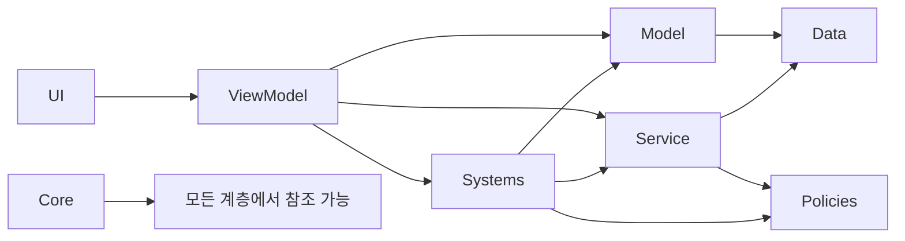

# DCommando

### 계층 구조
```
Root
 ┣ Core                // 이벤트, 상태머신, DI, 유틸
 ┣ Systems             // 게임 도메인 시스템(전투, 퀘스트, 인벤토리 등)
 ┃ ┣ ...
 ┣ Policies            // 정책 도메인
 ┣ Models              // 도메인 데이터 모델
 ┣ Services            // 네트워크, 저장, SDK 연동
 ┣ UI                  // Unity View 계층
 ┣ ViewModels          // UI <-> 도메인 상태 연결
 ┗ Data                // ScriptableObject, Config, DB 모델
```
### 참조 방향


---
# OpenSource
- [UniTask](https://github.com/Cysharp/UniTask) - 유니티 쓰레드 관리
- [R3](https://github.com/Cysharp/R3) - 리액티브 프로그래밍
- [DOTween](https://assetstore.unity.com/packages/tools/animation/dotween-hotween-v2-27676) - 연출
- [Zenject](https://github.com/modesttree/Zenject?tab=readme-ov-file#installation-) - 의존성 주입
- [NSubstitute](https://github.com/Thundernerd/Unity3D-NSubstitute) - 테스트 용으로 사용
