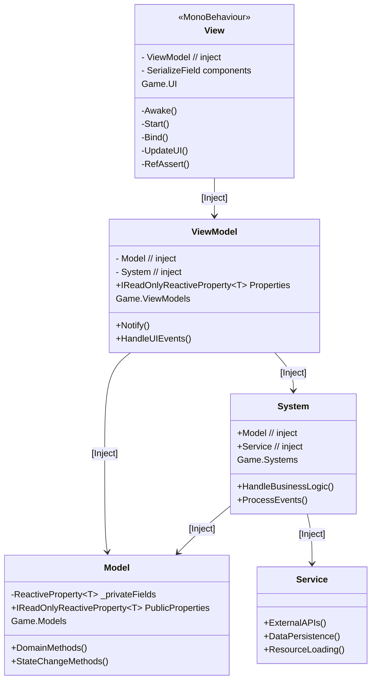

# ProjectC
**개발 기간 25.7.26 ~ 25.8.21 (한달)**


**확장성과 유지보수성을 고려한 Unity 게임 프로젝트**

이 프로젝트는 단순한 기능 구현을 넘어서, 확장성과 유지보수성을 고려한 구조적 설계에 중점을 두고 개발되었습니다.
# 목차
- [문서](#1)
- [영상](#2)
- [프로젝트 핵심 특징](#3)
- [주요 시스템](#4)
- [기술 스택](#5)
- [OpenSource](#6)
<a id=1> </a>
# 문서
- [개발일지](/DevelopmentLog_7_8.md)
<a id=2> </a>
# 영상
https://youtu.be/Ltw8gLyNqcM

<a id=3> </a>
# 프로젝트 핵심 특징

## 1. 계층별 완전 분리 구조

프로젝트는 명확한 책임 분리를 위해 9개 계층으로 구성되어 있습니다:

```
 ┣ 📁 _Editor/              // 각종 툴(BT Tool, Stage Tool)
 ┣ 📁 Core/                 // 공통 인프라 (게임 시간 관리, 이벤트 시스템, 유틸리티, 열거형, 스타일)
 ┣ 📁 Data/                 // 정적 데이터 관리 (ScriptableObject, 설정 파일, CSV)
 ┣ 📁 Models/               // 런타임 상태 관리 (ReactiveProperty 기반 도메인 모델)
 ┣ 📁 Policies/             // 비즈니스 규칙 (게임 정책, 계산 로직, 검증 규칙)
 ┣ 📁 Services/             // 외부 연동 (Addressables, 네트워크, 파일 I/O)
 ┣ 📁 Systems/              // 핵심 게임 로직 실행 (전투, AI, 경제, 제어)
 ┣ 📁 UI/                   // 프레젠테이션 계층 (MonoBehaviour 기반 View)
 ┗ 📁 ViewModels/           // UI-도메인 브릿지 (MVVM 패턴, 데이터 바인딩)
```

**의존성 방향 및 각 계층의 역할:**

```
UI (View 표현) 
 ↓
ViewModel (UI-도메인 바인딩)
 ↓  
System (게임 로직 처리) → Model (상태 관리) → Data (정적 데이터)
 ↓                        ↓
Service (외부 연동) → Policy (비즈니스 규칙)
 ↓
Data (설정/리소스)

Core: 모든 계층에서 공통 사용하는 인프라
Editor: 개발 시에만 사용하는 도구들
```

### 계층별 상세 역할:

- **Editor**: 각종 툴(BT Tool, Stage Tool)
- **Core**: 전체 프로젝트 공통 인프라 (게임 시간 관리, 이벤트 시스템, 유틸리티, 열거형, 스타일)
- **Data**: 게임 설정과 정적 데이터 (ScriptableObject, CSV, 설정 파일)
- **Models**: 런타임 게임 상태 (ReactiveProperty로 변경 알림 제공)
- **Policies**: 게임 규칙과 비즈니스 로직 (가격 정책, 데미지 계산 등)
- **Services**:  외부 연동 (Addressables, 네트워크, 파일 I/O)
- **Systems**: 핵심 게임 로직 실행 (전투, AI, 경제, 제어)
- **UI**: 사용자 인터페이스 (MonoBehaviour 기반 View)
- **ViewModels**: UI와 도메인 연결 (MVVM 패턴으로 데이터 바인딩)

## 2. MVVM 패턴 적용

완전한 MVVM 구조로 UI와 비즈니스 로직을 분리하여 테스트 가능하고 유지보수가 용이한 구조:



**MVVM 구조 특징:**

- **View**: Unity MonoBehaviour 기반 UI, Zenject 의존성 주입
- **ViewModel**: ReactiveProperty 데이터 바인딩, UI 로직 처리
- **Model**: ReactiveProperty 기반 도메인 상태 관리
- **System**: 비즈니스 로직 처리, 이벤트 핸들링


**주요 특징:**
- **ReactiveProperty**: 자동 UI 업데이트 및 상태 변경 알림

## 3. 에디터 도구

개발 효율성을 위한 커스텀 에디터 도구들:

### BehaviourTreeWindowEditor
**비주얼 AI 편집기**
- **기능**: 드래그 앤 드롭 방식의 행동트리 시각 편집
- **구성**: ActionNodes, ConditionNodes, CompositeNodes, DecoratorNodes
- **ScriptableObject 기반 데이터 저장**
- **실시간 디버깅**: 런타임 노드 상태 시각화


### StageConfigWindowEditor  
**스테이지 설정 에디터**
- **기능**: 스테이지별 게임 파라미터 통합 관리
- **설정 항목**:
  - **적 스폰**: 적 타입, 위치
  - **난이도**: 체력, 공격력
  - **보상**: 경험치, 골드 드롭
- **ScriptableObject 기반 데이터 저장**


### SkillDataEditor
**스킬 데이터 관리 도구**  
- **기능**: 스킬 시스템 통합 데이터 편집기
- **스킬 구성**:
  - **기본 정보**: 스킬명, 기본 데미지, 추가 데미지, 범위
  - **범위 종류**: SkillRangeType (단일, 원형, 부채꼴, 직선)
- **ScriptableObject 기반 데이터 저장**


## 4. Addressables & CSV 기반 데이터 관리

### Addressables 리소스 관리
제네릭 기반 타입 안전한 리소스 관리 시스템:

```csharp
public class AddressableService<TKey, TAsset> : IAddressableService<TKey, TAsset>
    where TAsset : UnityEngine.Object 
{
    private readonly Dictionary<TKey, TAsset> _loadedAssets = new();
    private readonly Dictionary<TKey, string> _keyToAddressMap = new();
    
    public void RegisterAddressKeys(IReadOnlyDictionary<TKey, string> addressMap) 
    {
        foreach (var kvp in addressMap) {
            _keyToAddressMap[kvp.Key] = kvp.Value;
        }
    }
    
    public async UniTask<TAsset> LoadAssetAsync(TKey key) 
    {
        if (!_keyToAddressMap.TryGetValue(key, out string addressKey)) {
            GameDebug.LogError($"주소 키를 찾을 수 없음: {key}");
            return null;
        }
        
        var handle = Addressables.LoadAssetAsync<TAsset>(addressKey);
        return await handle.ToUniTask();
    }
}
```

### CSV 기반 키 관리 시스템
**CSVReader로 Addressables 키 동적 로딩:**

```csharp
public static class CSVReader 
{
    // Key-Value 쌍으로 CSV 읽기 (첫 번째 열=Key, 두 번째 열=Value)
    public static Dictionary<string, string> ReadToDictionary(string fileName) 
    {
        var asset = ReadAddressables(fileName, out var handle);
        var dict = ReadToDictionaryFromText(asset.text);
        Addressables.Release(handle);
        return dict;
    }
    
    // 다중 컬럼 데이터 읽기
    public static Dictionary<string, List<string>> ReadToMultiColumnDictionary(string fileName)
    {
        // CSV의 모든 컬럼을 List<string>으로 변환
    }
}
```

**주요 특징:**
- **CSV 키 관리**: AddressablesKey.csv로 모든 리소스 키 중앙 관리
- **제네릭 서비스**: `AddressableService<TKey, TAsset>`로 타입 안전성 보장
- **메모리 관리**: 로드된 에셋 캐싱 및 자동 핸들 해제

**관리되는 데이터:**
- **AddressablesKey.csv**: 리소스 키 매핑 테이블
- **UpgradeTable.csv**: 업그레이드 데이터 및 밸런싱
  
**장점:**
- **코드 재컴파일 불필요**: CSV 수정만으로 데이터 변경
- **메모리 최적화**: 필요한 시점에만 로딩 및 캐싱

## 5. 이벤트 기반 아키텍처

느슨한 결합을 위한 이벤트 시스템:

```csharp
// 이벤트 정의 (readonly struct 패턴)
public readonly struct GameEvent
{
    public readonly int value;
    public readonly string data;
    
    public GameEvent(int value, string data)
    {
        this.value = value;
        this.data = data;
    }
}

// 이벤트 발행
EventBus.Publish(new GameEvent(100, "data"));

// 이벤트 구독
EventBus.Subscribe<GameEvent>(OnEventReceived);

private void OnEventReceived(GameEvent evt)
{
    // 이벤트 처리 로직
}
```

## 6. Zenject 의존성 주입

**계층별 DI Container 구성:**

각 계층별로 Installer를 분리하여 관리하는 이유:
- **모듈화**: 계층별 독립적 관리 및 테스트
- **책임 분리**: 각 계층의 의존성만 관리
- **확장성**: 새로운 시스템 추가 시 해당 계층만 수정
- **디버깅**: 의존성 문제 발생 시 특정 계층으로 범위 축소

```csharp
// Models 계층 - 도메인 상태 관리
public class ModelInstaller : MonoInstaller
{
    public override void InstallBindings()
    {
        Container.Bind<ExpModel>().AsSingle();
        Container.Bind<HealthModel>().AsSingle();
        Container.Bind<CombatModel>().AsSingle();
        Container.Bind<EconomyModel>().AsSingle();
    }
}

// Systems 계층 - 비즈니스 로직 처리
public class SystemInstaller : MonoInstaller
{
    public override void InstallBindings()
    {
        Container.Bind<CombatSystem>().AsSingle();
        Container.Bind<UpgradeSystem>().AsSingle();
        Container.Bind<InputSystem>().AsSingle();
    }
}

// Services 계층 - 외부 연동
public class ServiceInstaller : MonoInstaller
{
    public override void InstallBindings()
    {
        Container.Bind<IAddressableService>().To<AddressableService>().AsSingle();
        Container.Bind<IUIService>().To<UIService>().AsSingle();
    }
}

// ViewModels 계층 - UI 바인딩
public class ViewModelInstaller : MonoInstaller
{
    public override void InstallBindings()
    {
        Container.Bind<ExpViewModel>().AsSingle();
        Container.Bind<HealthViewModel>().AsSingle();
    }
}
```

<a id=4> </a>
# 주요 시스템

[**`Behaviour Tree`**](/Assets/01.Scripts/Systems/AI/BehaviourTree/SO_BehaviourTree.cs)
- ScriptableObject 기반 시각적 AI 편집 및 실행

[**`Combat System`**](/Assets/01.Scripts/Systems/Combat/CombatSystem.cs)
- 데미지 타입별 처리
- 공격력, 방어력 처리

[**`Health System`**](/Assets/01.Scripts/Systems/Combat/HealthSystem.cs)
- 데미지 처리 및 체력 회복 로직

[**`Equip System`**](/Assets/01.Scripts/Systems/Combat/EquipSystem.cs)
- 3종류 장비 관리: 무기, 방어구, 악세사리 
- Service -> Addressables 기반 장비 인스턴스 로딩
- 장착 가능 여부 검증 및 자동 해제 기능
- Service -> Firebase를 통한 장비 관리

[**`Upgrade System`**](/Assets/01.Scripts/Systems/Upgrade/UpgradeSystem.cs)
- 다양한 업그레이드 타입: 공격력, 체력, 스킬 강화, 이동속도
- 조건부 업그레이드: 레벨, 골드, 아이템 기반 조건 시스템
- CSV 기반 업그레이드 테이블 관리

[**`Gold System`**](/Assets/01.Scripts/Systems/Economy/GoldSystem.cs), [**`Crystal System`**](/Assets/01.Scripts/Systems/Economy/CrystalSystem.cs)
- 골드, 크리스탈 등 다중 화폐 관리
- 정책 기반: `GoldPolicy`, `CrystalPolicy`로 유연한 가격 정책
- Service -> Firebase를 통한 Crystal 관리
  
[**`Experience System`**](/Assets/01.Scripts/Systems/Player/ExpSystem.cs)
- 경험치 획득 및 레벨업 처리

[**`Input System`**](/Assets/01.Scripts/Systems/Input/InputSystem.cs)
- 멀티 플랫폼: `PCInputStrategy`, `MobileInputStrategy`
- 전략 패턴: `IInputStrategy` 기반 플랫폼별 입력 처리

[**`Weapon System`**](/Assets/01.Scripts/Systems/Combat/WeaponSystem.cs)
- 인터페이스 기반 무기 시스템: `IWeapon` 구현
- 다양한 공격 범위: Circle, Sector, Rectangle, Line 타입
- 스킬 데이터 연동: `SO_SkillData` 기반 무기 설정
- 실시간 스탯 업그레이드: 공격력, 범위, 각도 배율 적용

[**`Stage System`**](/Assets/01.Scripts/Systems/Stage/StageSystem.cs)
- CSV 기반 스테이지 설정 관리
- 스테이지별 적 스폰 및 난이도 조절

[**`UI System`**](/Assets/01.Scripts/Systems/UI/UISystem.cs)
- Canvas 분리(HUD, Overlay, Popup, Screen) 
- Service -> Addressables 기반 UI 생성, 제거

<a id=5> </a>
# 🛠️ 기술 스택

- **Unity 6000.3.0a3**
- **Zenject** - 의존성 주입
- **R3** - ReactiveProperty & 비동기 처리
- **Addressables** - 리소스 관리
- **UniTask** - 비동기 작업
- **Firebase** - 데이터 저장, 로그인
- **DOTween** - 트위닝 애니메이션

<a id=6> </a>
# OpenSource
- [UniTask](https://github.com/Cysharp/UniTask) - 유니티 쓰레드 관리
- [R3](https://github.com/Cysharp/R3) - 리액티브 프로그래밍
- [DOTween](https://assetstore.unity.com/packages/tools/animation/dotween-hotween-v2-27676) - 연출
- [Zenject](https://github.com/modesttree/Zenject?tab=readme-ov-file#installation-) - 의존성 주입
